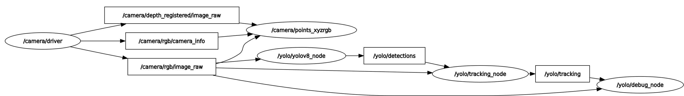
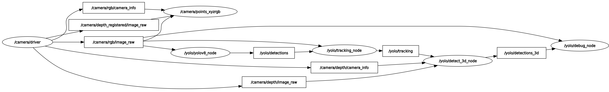

# yolo_ros

ROS 2 wrap for YOLO models from [Ultralytics](https://github.com/ultralytics/ultralytics) to perform object detection and tracking, instance segmentation, human pose estimation and Oriented Bounding Box (OBB). There are also 3D versions of object detection, including instance segmentation, and human pose estimation based on depth images.

<div align="center">

[](https://opensource.org/license/gpl-3-0) [](https://github.com/mgonzs13/yolo_ros/releases) [](https://github.com/mgonzs13/yolo_ros?branch=main) [](https://libraries.io/github/mgonzs13/yolo_ros?branch=main) [](https://github.com/mgonzs13/yolo_ros/commits/main) [](https://github.com/mgonzs13/yolo_ros/issues) [](https://github.com/mgonzs13/yolo_ros/pulls) [](https://github.com/mgonzs13/yolo_ros/graphs/contributors) [](https://github.com/mgonzs13/yolo_ros/actions/workflows/python-formatter.yml?branch=main) [](https://mgonzs13.github.io/yolo_ros/latest)

| ROS 2 Distro |                          Branch                          |                                                                                                      Build status                                                                                                      |                                                               Docker Image                                                                |
| :----------: | :------------------------------------------------------: | :--------------------------------------------------------------------------------------------------------------------------------------------------------------------------------------------------------------------: | :---------------------------------------------------------------------------------------------------------------------------------------: |
|  **Humble**  | [`main`](https://github.com/mgonzs13/yolo_ros/tree/main) |  [](https://github.com/mgonzs13/yolo_ros/actions/workflows/humble-docker-build.yml?branch=main)   |  [](https://hub.docker.com/r/mgons/yolo_ros/tags?name=humble)  |
|   **Iron**   | [`main`](https://github.com/mgonzs13/yolo_ros/tree/main) |     [](https://github.com/mgonzs13/yolo_ros/actions/workflows/iron-docker-build.yml?branch=main)      |    [](https://hub.docker.com/r/mgons/yolo_ros/tags?name=iron)    |
|  **Jazzy**   | [`main`](https://github.com/mgonzs13/yolo_ros/tree/main) |    [](https://github.com/mgonzs13/yolo_ros/actions/workflows/jazzy-docker-build.yml?branch=main)    |   [](https://hub.docker.com/r/mgons/yolo_ros/tags?name=jazzy)   |
|  **Kilted**  | [`main`](https://github.com/mgonzs13/yolo_ros/tree/main) |  [](https://github.com/mgonzs13/yolo_ros/actions/workflows/kilted-docker-build.yml?branch=main)   |  [](https://hub.docker.com/r/mgons/yolo_ros/tags?name=kilted)  |
| **Rolling**  | [`main`](https://github.com/mgonzs13/yolo_ros/tree/main) | [](https://github.com/mgonzs13/yolo_ros/actions/workflows/rolling-docker-build.yml?branch=main) | [](https://hub.docker.com/r/mgons/yolo_ros/tags?name=rolling) |

</div>

## Table of Contents

1. [Installation](#installation)
2. [Docker](#docker)
3. [Models](#models)
4. [Usage](#usage)
5. [Lifecycle Nodes](#lifecycle-nodes)
6. [Demos](#demos)

## Installation

```shell
# Clone this repo
cd ~/ros2_ws/src
git clone https://github.com/mgonzs13/yolo_ros.git

# Install uv and python dependencies
curl -LsSf https://astral.sh/uv/install.sh | sh
source ~/.bashrc
cd ~/ros2_ws/src/yolo_ros
uv sync

# Install rosdep dependencies and build
cd ~/ros2_ws
rosdep install --from-paths src --ignore-src -r -y
colcon build && source install/setup.bash
```

## Docker

Build the yolo_ros docker.

```shell
docker build -t yolo_ros .
```

Run the docker container. If you want to use CUDA, you have to install the [NVIDIA Container Tollkit](https://docs.nvidia.com/datacenter/cloud-native/container-toolkit/latest/install-guide.html) and add `--gpus all`.

```shell
docker run -it --rm --gpus all yolo_ros
```

## Models

The compatible models for yolo_ros are the following:

- [YOLOv3](https://docs.ultralytics.com/models/yolov3/)
- [YOLOv4](https://docs.ultralytics.com/models/yolov4/)
- [YOLOv5](https://docs.ultralytics.com/models/yolov5/)
- [YOLOv6](https://docs.ultralytics.com/models/yolov6/)
- [YOLOv7](https://docs.ultralytics.com/models/yolov7/)
- [YOLOv8](https://docs.ultralytics.com/models/yolov8/)
- [YOLOv9](https://docs.ultralytics.com/models/yolov9/)
- [YOLOv10](https://docs.ultralytics.com/models/yolov10/)
- [YOLOv11](https://docs.ultralytics.com/models/yolo11/)
- [YOLOv12](https://docs.ultralytics.com/models/yolo12/)
- [YOLO-World](https://docs.ultralytics.com/models/yolo-world/)
- [YOLOE](https://docs.ultralytics.com/models/yoloe/)
- [YOLOv26](https://docs.ultralytics.com/models/yolo26/)

## Usage

<details>
<summary>Click to expand</summary>

### YOLOv5

```shell
ros2 launch yolo_bringup yolov5.launch.py
```

### YOLOv8

```shell
ros2 launch yolo_bringup yolov8.launch.py
```

### YOLOv9

```shell
ros2 launch yolo_bringup yolov9.launch.py
```

### YOLOv10

```shell
ros2 launch yolo_bringup yolov10.launch.py
```

### YOLOv11

```shell
ros2 launch yolo_bringup yolov11.launch.py
```

### YOLOv12

```shell
ros2 launch yolo_bringup yolov12.launch.py
```

### YOLO-World

```shell
ros2 launch yolo_bringup yolo-world.launch.py
```

### YOLOE

```shell
ros2 launch yolo_bringup yoloe.launch.py
```

</details>

<p align="center">
  
</p>

### Topics

- **/yolo/detections**: Objects detected by YOLO using the RGB images. Each object contains a bounding box and a class name. It may also include a mark or a list of keypoints.
- **/yolo/tracking**: Objects detected and tracked from YOLO results. Each object is assigned a tracking ID.
- **/yolo/detections_3d**: 3D objects detected. YOLO results are used to crop the depth images to create the 3D bounding boxes and 3D keypoints.
- **/yolo/debug_image**: Debug images showing the detected and tracked objects. They can be visualized with rviz2.

### Services

- **/yolo/enable**: Service to enable or disable the detection node. Accepts a boolean value (True/False).
- **/yolo/set_classes** (YOLOWorld only): Service to dynamically set the detection classes. This service is only available when using the YOLO-World model and allows you to update the list of object classes the model should detect without restarting the node.

### Parameters

These are the parameters from the [yolo.launch.py](./yolo_bringup/launch/yolo.launch.py), used to launch all models. Check out the [Ultralytics page](https://docs.ultralytics.com/modes/predict/#inference-arguments) for more details.

- **model_type**: Ultralytics model type (default: YOLO)
- **model**: YOLO model (default: yolov8m.pt)
- **tracker**: Tracker file (default: bytetrack.yaml)
- **device**: GPU/CUDA (default: cuda:0)
- **fuse_model**: Whether to fuse the YOLO model for inference optimization (default: False)
- **yolo_encoding**: Encoding to convert input image before using YOLO (default: bgr8)
- **enable**: Whether to start YOLO enabled (default: True)
- **threshold**: Detection threshold (default: 0.5)
- **iou**: Intersection Over Union (IoU) threshold for Non-Maximum Suppression (NMS) (default: 0.7)
- **imgsz_height**: Image height for inference (default: 480)
- **imgsz_width**: Image width for inference (default: 640)
- **half**: Whether to enable half-precision (FP16) inference speeding up model inference with minimal impact on accuracy (default: False)
- **max_det**: Maximum number of detections allowed per image (default: 300)
- **augment**: Whether to enable test-time augmentation (TTA) for predictions improving detection robustness at the cost of speed (default: False)
- **agnostic_nms**: Whether to enable class-agnostic Non-Maximum Suppression (NMS) merging overlapping boxes of different classes (default: False)
- **retina_masks**: Whether to use high-resolution segmentation masks if available in the model, enhancing mask quality for segmentation (default: False)
- **input_image_topic**: Camera topic of RGB images (default: /camera/rgb/image_raw)
- **image_reliability**: Reliability for the image topic: 0=system default, 1=Reliable, 2=Best Effort (default: 1)
- **input_depth_topic**: Camera topic of depth images (default: /camera/depth/image_raw)
- **depth_image_reliability**: Reliability for the depth image topic: 0=system default, 1=Reliable, 2=Best Effort (default: 1)
- **input_depth_info_topic**: Camera topic for info data (default: /camera/depth/camera_info)
- **depth_info_reliability**: Reliability for the depth info topic: 0=system default, 1=Reliable, 2=Best Effort (default: 1)
- **target_frame**: frame to transform the 3D boxes (default: base_link)
- **depth_image_units_divisor**: Divisor to convert the depth image into meters. Depends on the camera you are using (default: 1000)
- **use_tracking**: Whether to activate tracking after detection (default: True)
- **use_3d**: Whether to activate 3D detections (default: False)
- **use_debug**: Whether to activate debug node (default: True)

## Lifecycle Nodes

Previous updates add Lifecycle Nodes support to all the nodes available in the package.
This implementation tries to reduce the workload in the unconfigured and inactive states by only loading the models and activating the subscriber on the active state.

These are some resource comparisons using the default yolov8m.pt model on a 30fps video stream.

| State    | CPU Usage (i7 12th Gen) | VRAM Usage | Bandwidth Usage |
| -------- | ----------------------- | ---------- | --------------- |
| Active   | 40-50% in one core      | 628 MB     | Up to 200 Mbps  |
| Inactive | ~5-7% in one core       | 338 MB     | 0-20 Kbps       |

<p align="center">
  
</p>

## Demos

## Object Detection

This is the standard behavior of yolo_ros which includes object tracking.

```shell
ros2 launch yolo_bringup yolo.launch.py
```

[](https://drive.google.com/file/d/1gTQt6soSIq1g2QmK7locHDiZ-8MqVl2w/view?usp=sharing)

## Instance Segmentation

Instance masks are the borders of the detected objects, not all the pixels inside the masks.

```shell
ros2 launch yolo_bringup yolo.launch.py model:=yolov8m-seg.pt
```

[](https://drive.google.com/file/d/1dwArjDLSNkuOGIB0nSzZR6ABIOCJhAFq/view?usp=sharing)

## Human Pose

Visible persons are detected along with their skeleton keypoints.

```shell
ros2 launch yolo_bringup yolo.launch.py model:=yolov8m-pose.pt
```

[](https://drive.google.com/file/d/1pRy9lLSXiFEVFpcbesMCzmTMEoUXGWgr/view?usp=sharing)

## 3D Object Detection

The 3D bounding boxes are calculated by filtering the depth image data from an RGB-D camera using the 2D bounding box. Only objects with a 3D bounding box are visualized in the 2D image.

```shell
ros2 launch yolo_bringup yolo.launch.py use_3d:=True
```

[](https://drive.google.com/file/d/1ZcN_u9RB9_JKq37mdtpzXx3b44tlU-pr/view?usp=sharing)

## 3D Object Detection (Using Instance Segmentation Masks)

In this, the depth image data is filtered using the max and min values obtained from the instance masks. Only objects with a 3D bounding box are visualized in the 2D image.

```shell
ros2 launch yolo_bringup yolo.launch.py model:=yolov8m-seg.pt use_3d:=True
```

[](https://drive.google.com/file/d/1wVZgi5GLkAYxv3GmTxX5z-vB8RQdwqLP/view?usp=sharing)

## 3D Human Pose

Each keypoint is projected in the depth image and visualized using purple spheres. Only objects with a 3D bounding box are visualized in the 2D image.

```shell
ros2 launch yolo_bringup yolo.launch.py model:=yolov8m-pose.pt use_3d:=True
```

[](https://drive.google.com/file/d/1j4VjCAsOCx_mtM2KFPOLkpJogM0t227r/view?usp=sharing)
